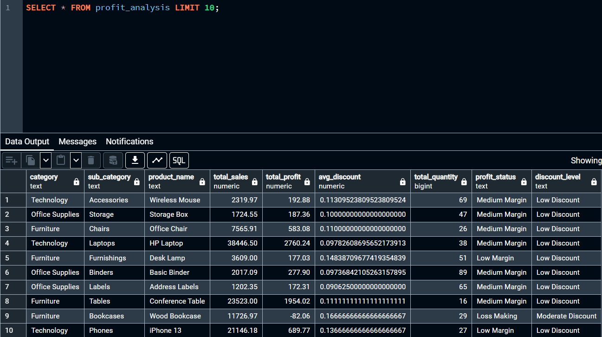
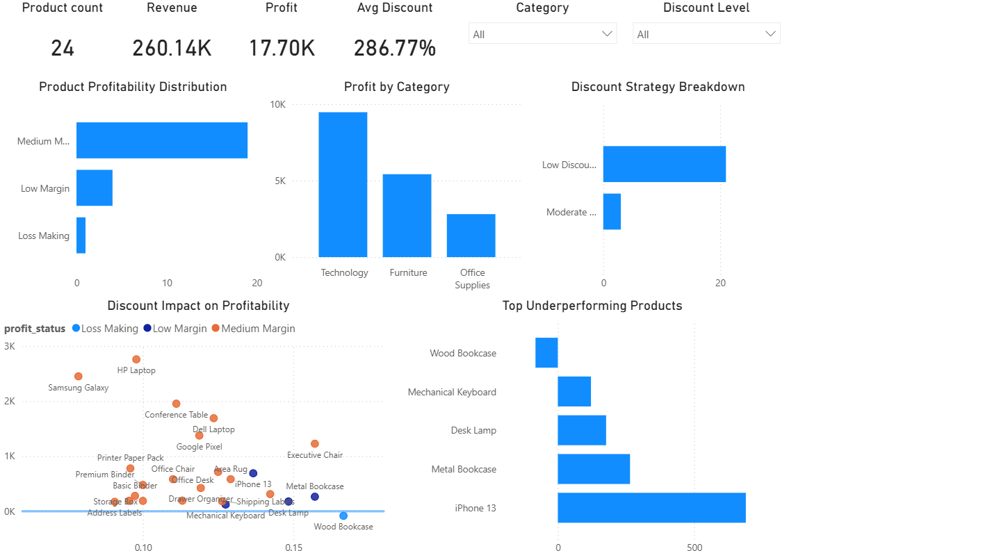

# Revenue Leakage & Profit Optimization Analysis (SQL + Power BI)

## Overview
This project analyzes product-level sales, profit, and discount behavior to identify revenue leakage and uncover underperforming products.

The goal is to move beyond raw revenue and understand where aggressive discounting may be negatively impacting profitability.

---

## Tools Used
- PostgreSQL
- SQL (CTEs, CASE statements, aggregations)
- Power BI (data modeling, visualization)

---

## Data Preparation

A SQL view called `profit_analysis` was created to transform transactional data into product-level insights.

Key transformations include:
- Aggregating total sales, profit, quantity, and average discount per product
- Calculating profit margin using profit vs sales
- Classifying products into:
  - Loss Making
  - Low Margin
  - Medium Margin
  - High Margin
- Categorizing discount levels:
  - Low Discount
  - Moderate Discount
  - High Discount

---

## Dashboard Features

- **KPI Metrics**
  - Product Count
  - Revenue
  - Profit
  - Average Discount

- **Product Profitability Distribution**
  - Breakdown of products by margin category

- **Profit by Category**
  - Comparison of profitability across product categories

- **Discount Strategy Breakdown**
  - Distribution of products across discount levels

- **Discount Impact on Profitability**
  - Scatter plot showing relationship between discounting and profit

- **Top Underperforming Products**
  - Identifies products with low or negative profitability

---

## Key Insights

- A majority of products fall into the medium margin category
- High discounting does not consistently lead to higher profitability
- Several products show low or negative profit despite moderate to high discounts
- Revenue leakage is primarily driven by over-discounted, low-margin products

---

## Project Structure

data/
sql/
powerbi/
screenshots/
README.md

## Screenshots

### SQL View

### Dashboard

